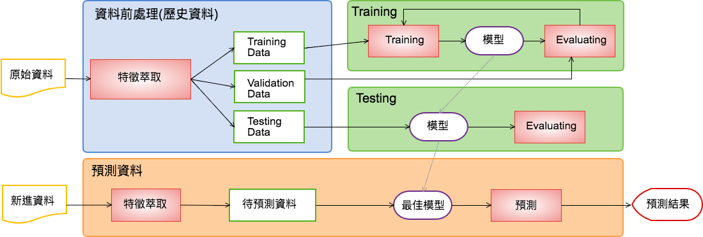

# 什麼是機器學習?

[//]:中文
[//]: [English](../machineLearngng_en.md)

--

從大量歷史中學習預測未來發生事情的結果。

### 簡單敘述
基於 **大量歷史資料、演算法** 找出最適合的預測模型，將陸續發生的資料跑預測模型，預測未來的可能趨勢。

#### 可以做什麼?
舉凡累積大量資料的領域都有機會應用找出潛在的規則。像是，

- 商業應用: 推薦系統(Google, Youtube)、詐騙偵測
- 金融預測：證券交易
- 自然語言識別：語音識別(Alexa)、搜尋引擎(Google)

#### 運行流程

### 分類
主要可分為三類、分別為Supervised Learning、Unsupervised Learning、Reinforcement Learning 

| 分類 | 簡介 | Label | 方法 |
| --- | ---  | --- | --- |
| Supervised Learning | 每種情況都可被分類到某一個結果中 |  V |Classification、Regression |
| Unsupervised Learning | 針對input data的特徵，找出是否有類似的特徵可以被區分成為一群 |  X | Clustering |
| Reinforcement Learning | 透過不斷的嘗試各種組合，會知道怎樣能達到目標，最後得出符合目標的結果| -- | Deep Learning |

### 為何有了統計，還要用Machine Learning？
統計跟Machine Learning 本質上都是用歷史資料來解決/預測未來的問題。
然而，這兩個些微差距在於．

統計：

基於一些假定(assumptions)和模型檢查(checking of models)來預測，在大維度的dataset中，會有部分結果是無法被取得的。

Machine Learning: 

扣除了assumptions 和 model checking，可支援較大維度的dataset，找出多一些結果。

[Ref](https://www.analyticsvidhya.com/blog/2015/07/difference-machine-learning-statistical-modeling/)

[Ref (stackexanchge)](https://stats.stackexchange.com/questions/6/the-two-cultures-statistics-vs-machine-learning)

--
參考資料：

1. [書] Python + Spark 機器學習與大數據分析實戰
2. [Wiki] Feature Extraction
3. [Article - Types of ML] (https://www.linkedin.com/pulse/types-ml-supervised-unsupervised-reinforcement-learning-jamal)
